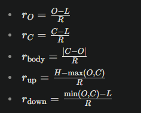
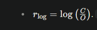
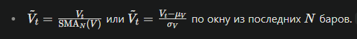
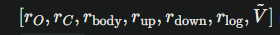

# pj12_minutes_to_vectors

Python 3.14.2

Минутные бары в вектора.
Создание векторов из минутных баров для последующего использования в машинном обучении.  
  
  
  
  

Из минутных векторов создаются дневные векторы.  
Дневные векторы срвниваются для прогноза движения цены.

Производится симуляционная торговля на основе динамически прогнозов.  
  
Идея оказалась не работоспособной.